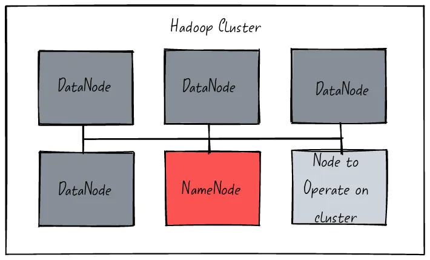

# Hadoop Map Reduce Docker
Running Map Reduce jobs using Docker


## Overview

#### HDFS

HDFS, or Hadoop Distributed File System, is a distributed file system designed to store and
process large datasets using commodity hardware. It is part of the Apache Hadoop ecosystem
and is widely used in big data processing. HDFS uses a master-slave architecture with one
NameNode and multiple DataNodes. The NameNode manages the file system metadata, while the
DataNodes store the actual data. This allows for scalable and fault-tolerant data storage
and processing. HDFS is optimized for batch processing and sequential reads, making it
well-suited for applications like log analysis, data warehousing, and machine learning.
However, it is not well suited for random writes and low-latency data access. HDFS is a
critical component of the Hadoop ecosystem and is used by many big data applications.
Its scalable and fault-tolerant design makes it a reliable choice for storing and
processing large datasets. Overall, HDFS plays a crucial role in the world of big
data and is an essential tool for data engineers and analysts.



#### Map Reduce

In the context of Hadoop, MapReduce is a programming model and framework for processing
large datasets in a distributed computing environment. Hadoop is an open-source software
framework that is widely used for distributed storage and processing of big data.

Hadoop MapReduce is the processing component of the Hadoop framework, and it provides a
way to process large datasets in parallel across a cluster of nodes. The MapReduce
framework is based on the MapReduce programming model, which divides the data
processing into two main stages: the "map" stage and the "reduce" stage.

In Hadoop MapReduce, the map stage reads the input data from Hadoop Distributed File
System (HDFS) and processes it in parallel across multiple nodes using mapper functions.
The output of the map stage is then shuffled and sorted before being sent to the reduce stage.

In the reduce stage, the output of the map stage is processed further using reducer functions,
which perform operations such as aggregation, summarization, and filtering. The output of the
 reduce stage is then written to the HDFS.

The Hadoop MapReduce framework provides a scalable and fault-tolerant way to process large
datasets in a distributed computing environment. It can be used for a wide range of data
processing tasks, including data mining, machine learning, and analytics.

Hadoop MapReduce is one of the core components of the Hadoop ecosystem, and it is widely
used in industries such as finance, healthcare, and e-commerce for processing and analyzing
big data.

#### Hadoop Streaming

Hadoop streaming is a utility that comes with the Hadoop distribution.
The utility allows you to create and run Map/Reduce jobs with any executable or script as
the mapper and/or the reducer. For example:

## Software Architecture

|File|Purpose|
|---|---|
|[docker-compose.yml](docker-compose.yml)|Docker compose with the infrastructure required to run the Hadoop cluster.|
|[requirements.txt](tests/requirements.txt)|Python requirements file.|
|[app/test_hdfs.py](tests/test_hdfs.py)|Python script that tests writing data into HDFS.|
|[app/mapper.sh](tests/mapper.sh)|Mapper job.|
|[app/reducer.sh](tests/reducer.sh)Reducer job.|

## References

- [Docker Hadoop](https://github.com/big-data-europe/docker-hadoop)
- [HDFS Simple Docker Installation Guide for Data Science Workflow](https://towardsdatascience.com/hdfs-simple-docker-installation-guide-for-data-science-workflow-b3ca764fc94b)
- [Set Up Containerize and Test a Single Hadoop Cluster using Docker and Docker compose](https://www.section.io/engineering-education/set-up-containerize-and-test-a-single-hadoop-cluster-using-docker-and-docker-compose/)=
- [Spark Docker](https://github.com/big-data-europe/docker-spark)
- [Hadoop Namenode](https://hub.docker.com/r/bde2020/hadoop-namenode)
- [Apache ZooKeeper](https://zookeeper.apache.org/)
- [Word Counter using Map Reduce on Hadoop](https://medium.com/analytics-vidhya/word-count-using-mapreduce-on-hadoop-6eaefe127502)
- [Hadoop Streaming](https://hadoop.apache.org/docs/r1.2.1/streaming.html)

## Instructions

#### Starting the Hadoop ecosystem
```bash
docker rm -f $(docker ps -a -q)
docker volume rm $(docker volume ls -q)
docker-compose up
```

#### Validating the status of the Hadoop cluster
```bash
docker ps
```
```bash
CONTAINER ID        IMAGE                                                    COMMAND                  CREATED             STATUS                    PORTS                                            NAMES
0f87a832960b        bde2020/hadoop-resourcemanager:2.0.0-hadoop3.2.1-java8   "/entrypoint.sh /r..."   12 hours ago        Up 54 seconds             0.0.0.0:8088->8088/tcp                           yarn
51da2508f5b8        bde2020/hadoop-historyserver:2.0.0-hadoop3.2.1-java8     "/entrypoint.sh /r..."   12 hours ago        Up 55 seconds (healthy)   0.0.0.0:8188->8188/tcp                           historyserver
ec544695c49a        bde2020/hadoop-nodemanager:2.0.0-hadoop3.2.1-java8       "/entrypoint.sh /r..."   12 hours ago        Up 56 seconds (healthy)   0.0.0.0:8042->8042/tcp                           nodemanager
810f87434b2f        bde2020/hadoop-datanode:2.0.0-hadoop3.2.1-java8          "/entrypoint.sh /r..."   12 hours ago        Up 56 seconds (healthy)   0.0.0.0:9864->9864/tcp                           datenode1
ca5186635150        bde2020/hadoop-namenode:2.0.0-hadoop3.2.1-java8          "/entrypoint.sh /r..."   12 hours ago        Up 56 seconds (healthy)   0.0.0.0:9000->9000/tcp, 0.0.0.0:9870->9870/tcp   namenode
beed8502828c        bde2020/hadoop-datanode:2.0.0-hadoop3.2.1-java8          "/entrypoint.sh /r..."   12 hours ago        Up 55 seconds (healthy)   0.0.0.0:9865->9864/tcp                           datenode2
[...]
```

#### Testing HDFS using raw HTTP requests.
The `-L` flag allows redirections. By default, the namenode redirects the request to any of the datanodes.
````bash
docker exec -it namenode /bin/bash
curl -L -i -X PUT "http://127.0.0.1:9870/webhdfs/v1/data/martin/lorem-ipsum.txt?op=CREATE" -d 'testing'
````
````bash
HTTP/1.1 307 Temporary Redirect
Date: Thu, 30 Mar 2023 00:40:44 GMT
Cache-Control: no-cache
Expires: Thu, 30 Mar 2023 00:40:44 GMT
Date: Thu, 30 Mar 2023 00:40:44 GMT
Pragma: no-cache
X-Content-Type-Options: nosniff
X-FRAME-OPTIONS: SAMEORIGIN
X-XSS-Protection: 1; mode=block
Location: http://datanode2.martincastroalvarez.com:9864/webhdfs/v1/data/martin/lorem-ipsum.txt?op=CREATE&namenoderpcaddress=namenode:9000&createflag=&createparent=true&overwrite=false
Content-Type: application/octet-stream
Content-Length: 0

HTTP/1.1 100 Continue

HTTP/1.1 201 Created
Location: hdfs://namenode:9000/data/martin/lorem-ipsum.txt
Content-Length: 0
Access-Control-Allow-Origin: *
Connection: close
````

#### Listing the content of the root directory
```bash
docker exec -it namenode /bin/bash
hdfs dfs -ls /
```
```bash
Found 1 items
drwxr-xr-x   - root supergroup          0 2023-03-03 14:15 /rmstate
```

#### Creating a new directory in HDFS
```bash
docker exec -it namenode /bin/bash
hdfs dfs -mkdir -p /user/root
hdfs dfs -ls /
```
```bash
Found 2 items
drwxr-xr-x   - root supergroup          0 2023-03-03 14:15 /rmstate
drwxr-xr-x   - root supergroup          0 2023-03-03 14:17 /user
```

#### Adding a file to HDFS
```bash
docker exec -it namenode /bin/bash
echo "lorem" > /tmp/hadoop.txt 
hdfs dfs -put ./input/* input
hdfs dfs -ls /user/
```
```bash
Found 2 items
-rw-r--r--   3 root supergroup          6 2023-03-03 14:20 /user/hadoop.txt
drwxr-xr-x   - root supergroup          0 2023-03-03 14:17 /user/root
```

#### Printing the content of a file in HDFS
```bash
docker exec -it namenode /bin/bash
hdfs dfs -cat /user/hadoop.txt 
```
```bash
lorem
```

#### Checking the status of the NameNode at [http://127.0.0.1:9870/dfshealth.html](http://127.0.0.1:9870/dfshealth.html)


#### Testing HDFS using Python

```python3
virtualenv -p python3 .env
source .env/bin/activate
pip install -r requirements.txt
python3 app/test_hdfs.py
```
```bash
[...]
Written: 684 files 336846 words 1852059 chars
```

#### Test the mapper job
```bash
echo "asdf asdf asdkfjh 99asdf asdf" | app/mapper.sh
```
```bash
asdf	1
asdf	1
asdkfjh	1
99asdf	1
asdf	1
```

#### Test the reducer job
```bash
echo "asdf 1 1 2 3" | app/reducer.sh 
```
```bash
asdf	7
```

#### Uploading the mapper and reducer jobs to the Docker container.
```bash
docker cp ./app/mapper.sh namenode:/tmp/mapper.sh
docker cp ./app/reducer.sh namenode:/tmp/reducer.sh
```

#### Entering into the namenode
```bash
docker exec -it namenode /bin/bash
```

#### Creating the directory for the Rap Reduce job.
```bash
hadoop fs -mkdir /jobs
```

#### Uploading the map and reduce job to HDFS.
```bash
hadoop fs -rm /jobs/mapper.sh
hadoop fs -rm /jobs/reducer.sh
hadoop fs -put /tmp/mapper.sh /jobs/mapper.sh
hadoop fs -put /tmp/reducer.sh /jobs/reducer.sh
hadoop fs -chmod 555 /jobs/mapper.sh
hadoop fs -chmod 555 /jobs/reducer.sh
hadoop fs -ls /jobs/
```

#### Running a Map Reduce job
```bash
hadoop fs -rmdir /jobs/output
hadoop jar \
    /opt/hadoop-3.2.1/share/hadoop/tools/lib/hadoop-streaming-3.2.1.jar \
    -files "/tmp/mapper.sh,/tmp/reducer.sh" \
    -input /user/martin/*.txt \
    -output /jobs/output \
    -mapper "mapper.sh" \
    -reducer "reducer.sh"
```
```bash
[...]
2023-03-31 06:52:25,803 INFO mapred.FileInputFormat: Total input files to process : 1164
[...]
2023-03-31 07:41:45,021 INFO mapreduce.JobSubmitter: Submitting tokens for job: job_1680237794579_0008
[...]
2023-03-31 07:41:45,627 INFO mapreduce.Job: Running job: job_1680237794579_0008
[...]
	Shuffle Errors
		BAD_ID=0
		CONNECTION=0
		IO_ERROR=0
		WRONG_LENGTH=0
		WRONG_MAP=0
		WRONG_REDUCE=0
	File Input Format Counters 
		Bytes Read=3776682
	File Output Format Counters 
		Bytes Written=4940135
2023-03-31 10:36:45,036 INFO streaming.StreamJob: Output directory: /jobs/output
```

#### Troubleshooting in case of failure
```bash
hadoop fs -ls /app-logs/root/logs-tfile/
hadoop fs -cat $(hadoop fs -ls /app-logs/root/logs-tfile/ | tail -1 | awk '{print $8}')/*
```
```bash
Found 7 items
drwxrwx---   - root root          0 2023-03-31 06:53 /app-logs/root/logs-tfile/application_1680237794579_0002
drwxrwx---   - root root          0 2023-03-31 07:39 /app-logs/root/logs-tfile/application_1680237794579_0003
drwxrwx---   - root root          0 2023-03-31 07:42 /app-logs/root/logs-tfile/application_1680237794579_0004
drwxrwx---   - root root          0 2023-03-31 07:46 /app-logs/root/logs-tfile/application_1680237794579_0005
drwxrwx---   - root root          0 2023-03-31 07:49 /app-logs/root/logs-tfile/application_1680237794579_0006
drwxrwx---   - root root          0 2023-03-31 07:51 /app-logs/root/logs-tfile/application_1680237794579_0007
drwxrwx---   - root root          0 2023-03-31 07:52 /app-logs/root/logs-tfile/application_1680237794579_0008
[...]
```

#### Open the History Server web interface at[http://127.0.0.1:8188/applicationhistory](http://127.0.0.1:8188/applicationhistory)


#### Verifying the results of the map reduce job
```bash
hadoop fs -ls /jobs/output/
```
```bash
Found 2 items
-rw-r--r--   3 root supergroup          0 2023-03-31 10:36 /jobs/output/_SUCCESS
-rw-r--r--   3 root supergroup    4940135 2023-03-31 10:36 /jobs/output/part-00000
```

#### Printing the output of the Map Reduce job
```bash
hadoop fs -cat /jobs/output/part-00000
```
```bash
[...]
1DXpWP	    12
1DYnnz	    44
1DZLd3	    3
1DZnOPEuK	20
1DZzz	    4
1Da	        10
```
